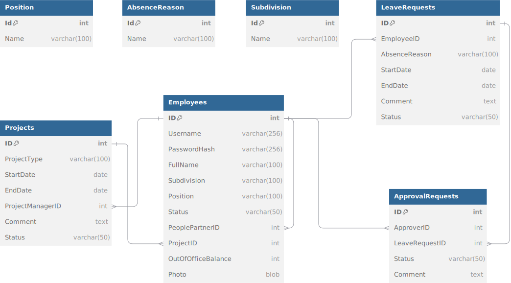

# Introduction
This project is built using the **ASP.NET Core MVC** framework in **.NET 8**. It serves as a basic Human Resource (HR) and Project Management System, with role-based access and management capabilities for HR managers, project managers, and company employees.

## Table of Contents
1. [Technologies Used](#technologies-used)
2. [System Features](#system-features)
   - HR Manager
   - Project Manager
   - Employees
3. [Roles in the System](#roles-in-the-system)
4. [Database Schema](#database-schema)
5. [How to Run the Project](#how-to-run-the-project)
6. [Database Setup](#database-setup)
7. [Live Demo](#live-demo)
8. [Future Enhancements](#future-enhancements)

## Technologies Used
- **ASP.NET Core MVC**: Web application framework for building dynamic websites using Model-View-Controller design pattern.
- **.NET 8**: The application is built on .NET 8, the latest version of the .NET framework.
- **ADO.NET**: Used for database interactions, handling SQL queries, and managing connections directly without an ORM.
- **Bootstrap**: For responsive UI and styling.
- **Razor Pages**: For dynamic rendering and seamless user experience.
- **SQL Server**: The database solution for storing employee, project, and leave request data.

## System Features

### 1. HR Manager
Upon login, the HR Manager has access to:
- **List of Employees**: Manage employee details (add, update, deactivate).
- **List of Projects**: View project details.
- **List of Leave Requests**: Handle requests and approve/reject them.
- **List of Approval Requests**: Manage pending approvals for employees' actions.

#### Key Capabilities:
- **Employee Management**: Add, update, or deactivate employees.
- **Approval Handling**: Approve/reject leave requests and manage employee absence balances.
- **Future Enhancements**: Sorting, searching, and filtering of table rows will be added in the next update.

### 2. Project Manager
The Project Manager can:
- **View List of Employees**: Assign employees to projects.
- **View List of Projects**: Add, update, or deactivate projects.
- **Handle Approval Requests**: Approve/reject leave and project-related requests.

#### Key Capabilities:
- **Project Management**: Add or update project information and assign team members.
- **Approval Handling**: Manage approval workflow for leave and project requests.
- **Future Enhancements**: Sorting, searching, and filtering of table rows will be added in the next update.

### 3. Employees
Employees can:
- **View their projects**: See their assigned projects and statuses.
- **Leave Request Management**: Submit, update, or cancel leave requests.
  
#### Key Capabilities:
- **Leave Requests**: Create new leave requests, submit for approval, and cancel if needed.
- **Future Enhancements**: Sorting, searching, and filtering of table rows will be added in the next update.

## Roles in the System

| Role                  | Description of Main Tasks                       |
|-----------------------|-------------------------------------------------|
| **Employee**          | Creates and manages leave requests              |
| **HR Manager**        | Manages employees, approves/rejects requests    |
| **Project Manager**   | Manages projects, approves/rejects requests     |
| **Administrator**     | Grants access rights, manages all data          |

## Database Schema
The system's database is structured to handle employee, project, and leave request data efficiently. The schema is displayed below:

<p align="center">
  
</p>

## How to Run the Project

1. Clone the repository.

   ```bash
   git clone https://github.com/JakubRoss/smtOffice
2. Open the solution in Visual Studio.
3. Restore NuGet packages:

```bash
dotnet restore
```
4. Set up your local SQL Server or update the connection string. In the appsettings.json file, locate the "ConnectionStrings" section and add or update the connection string under the key "DbConnection". For example:

```bash
"ConnectionStrings": {
  "LocalDbConnection": "Server=your_server;Database=your_database;User Id=your_username;Password=your_password;"
}
```
5. Build and run the project:

```bash
dotnet run
```
6. Access the application in your browser at http://localhost:<port-number>.
   
Default Admin Login:

- Username: admin
- Password: admin

## Database Setup
To create the database, use the provided SQL script smtDb.sql. This script initializes the database structure required for the application. The script is located in the same directory as this README.md file.

1. Open SQL Server Management Studio (SSMS).
2. Execute the script to create tables, relationships, and initial data:

```bash
smtDb.sql
```

## Live Demo

You can test the application live on Azure at the following URL:

https://smtit.azurewebsites.net/

## Future Enhancements
Planned enhancements include:

- Cascade Behavior: Setting up cascading deletes and updates for related entities.
- Indexes: Adding indexes for better query performance.
- Views: Implementing database views for easier data retrieval.
- Additional Functionality: Expansion of the application with more features will be done next weekend.

More at: https://smtit.azurewebsites.net/Overview

## Reporting Bugs

If you encounter any bugs or issues, or if you have suggestions for improvements, please feel free to report them. You can send an email to:

**Email**: [jakub.klonowsky@gmailcom](mailto:jakub.klonowsky@gmailcom)

We appreciate your feedback to help improve the system!
