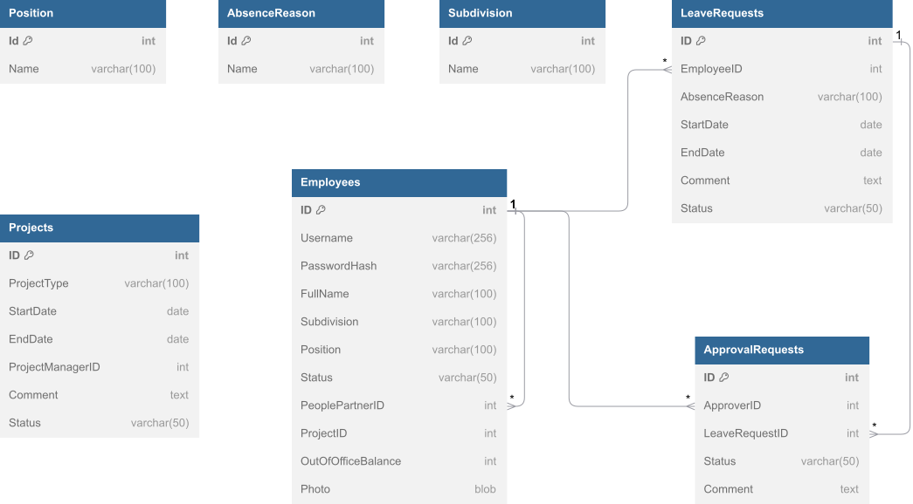

# Introduction

This project is built using the **ASP.NET Core MVC** framework in **.NET 8**. It serves as a basic Human Resource (HR) and Project Management System, with role-based access and management capabilities for HR managers, project managers, and company employees.

[](https://www.gnu.org/licenses/gpl-3.0)

## Table of Contents

1. [Technologies Used](#technologies-used)
2. [System Features](#system-features)
   - HR Manager
   - Project Manager
   - Employees
3. [Roles in the System](#roles-in-the-system)
4. [Database Schema](#database-schema)
5. [How to Run the Project](#how-to-run-the-project)

## Technologies Used

- **ASP.NET Core MVC**: Web application framework for building dynamic websites using Model-View-Controller design pattern.
- **.NET 8**: The application is built on .NET 8, the latest version of the .NET framework.
- **ADO.NET**: Used for database interactions, handling SQL queries, and managing connections directly without an ORM.
- **Bootstrap**: For responsive UI and styling.
- **Razor Pages**: For dynamic rendering and seamless user experience.
- **SQLite**: The database solution for storing employee, project, and leave request data.

## System Features

### 1. HR Manager

Upon login, the HR Manager has access to:

- **List of Employees**: Manage employee details (add, update, deactivate).
- **List of Projects**: View project details.
- **List of Leave Requests**: Handle requests and approve/reject them.
- **List of Approval Requests**: Manage pending approvals for employees' actions.

#### Key Capabilities:

- **Employee Management**: Add, update, or deactivate employees.
- **Approval Handling**: Approve/reject leave requests and manage employee absence balances.
- **Future Enhancements**: Sorting, searching, and filtering of table rows will be added in the next update.

### 2. Project Manager

The Project Manager can:

- **View List of Employees**: Assign employees to projects.
- **View List of Projects**: Add, update, or deactivate projects.
- **Handle Approval Requests**: Approve/reject leave and project-related requests.

#### Key Capabilities:

- **Project Management**: Add or update project information and assign team members.
- **Approval Handling**: Manage approval workflow for leave and project requests.
- **Future Enhancements**: Sorting, searching, and filtering of table rows will be added in the next update.

### 3. Employees

Employees can:

- **View their projects**: See their assigned projects and statuses.
- **Leave Request Management**: Submit, update, or cancel leave requests.

#### Key Capabilities:

- **Leave Requests**: Create new leave requests, submit for approval, and cancel if needed.
- **Future Enhancements**: Sorting, searching, and filtering of table rows will be added in the next update.

## Roles in the System

| Role                | Description of Main Tasks                    |
| ------------------- | -------------------------------------------- |
| **Employee**        | Creates and manages leave requests           |
| **HR Manager**      | Manages employees, approves/rejects requests |
| **Project Manager** | Manages projects, approves/rejects requests  |
| **Administrator**   | Grants access rights, manages all data       |

## Database Schema

The system's database is structured to handle employee, project, and leave request data efficiently. The schema is displayed below:

<p align="center">
  
</p>

#### ⚠️ Note on Project ↔ Employee Relationships

Currently, the relationship between Projects and Employees is implemented using simple foreign key references:

- Projects.ProjectManagerID points to Employees.ID

- Employees.ProjectID points to Projects.ID

**However, due to SQLite and MVP design constraints, no formal database-enforced foreign keys exist in both directions to avoid cyclic dependencies and complexity.**

This means that while the application ensures **data consistency at the code level**, the database does not enforce referential integrity in all places.

<!-- 💡 Future Plan: In the final release, this setup will be refactored into a many-to-many relationship using a junction table (e.g. EmployeeProjects), allowing multiple employees to be assigned to multiple projects, with stronger consistency enforced through actual FOREIGN KEY constraints. -->

This is a deliberate compromise to keep the initial version lightweight and flexible for rapid prototyping.

## How to Run the Project

1. Clone the repository.

   ```bash
   git clone https://github.com/JakubRoss/smtOffice
   ```

2. Open the solution in Visual Studio.
3. Restore NuGet packages:

```bash
dotnet restore
```

4. Build and run the project:

```bash
dotnet run
```

5. Access the application in your browser at http://localhost:<port-number>.

Default Admin Login:

- Username: admin
- Password: admin

## Database Setup

This branch uses **SQLite** for local development.

No additional database setup is required for the current version of the project.

## Reporting Bugs

If you encounter any bugs or issues, or if you have suggestions for improvements, please feel free to report them. You can send an email to:

**Email**: [kubemek](mailto:jakub.rosploch@gmail.com)

We appreciate your feedback to help improve the system!

This project is licensed under the GNU General Public License v3.0 – see the LICENSE file for details.
